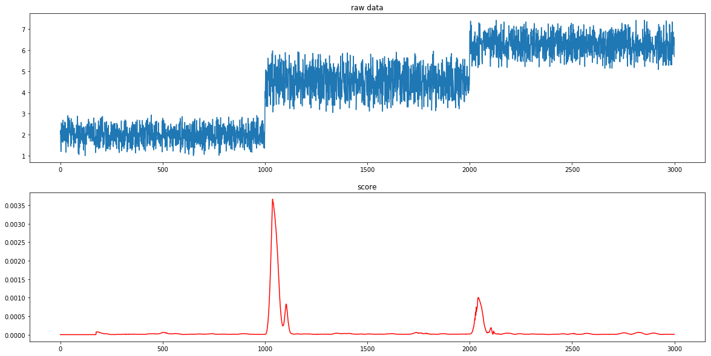
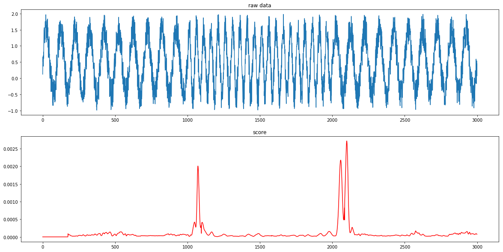

# SST (Singular Spectrum Transformation)
Implementation of Singular Spectrum Transformation for python.

## What is SST?
A change point detection algorithm



## Features
#### fast computation
* efficient algorithm using lanczos method
* [Numba](http://numba.pydata.org/)


## Installation
```
$python setup.py install
```

## Usage
```usage.py
from fastsst import SingularSpectrumTransformation

sst = SingularSpectrumTransformation(win_length=30)
score = sst.score_offline(data)
```

## TODO
* upload to PyPI
* implement efficient tridiag matrix decomposition
* online evaluation

## References
TODO
1. Tsuyoshi Ide et al., Change-Point Detection using Krylov Subspace Learning
2. Tsuyoshi Ide, Speeding up Change-Point Detection using Matrix Compression (Japanse)
